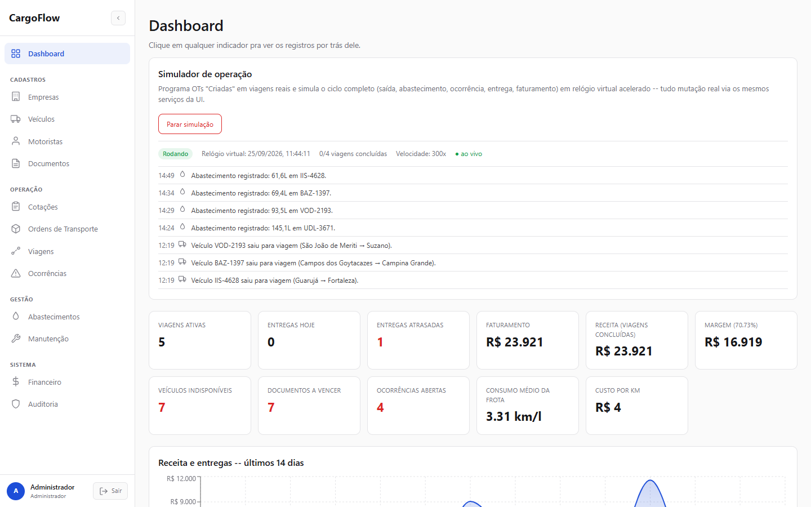
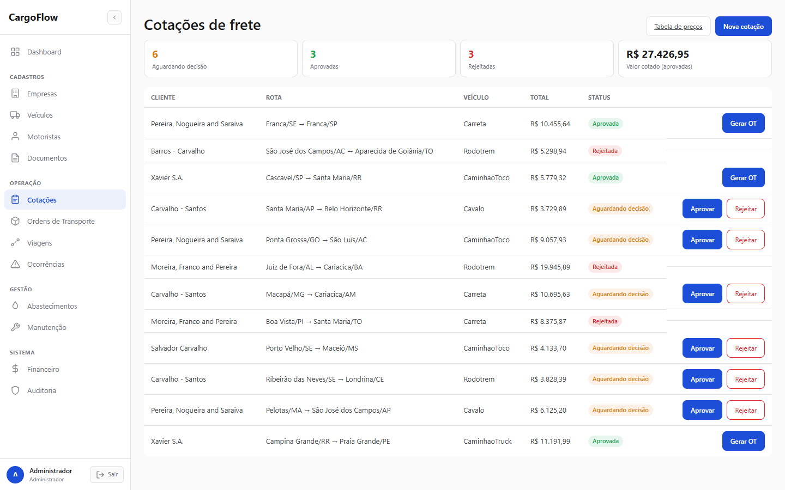
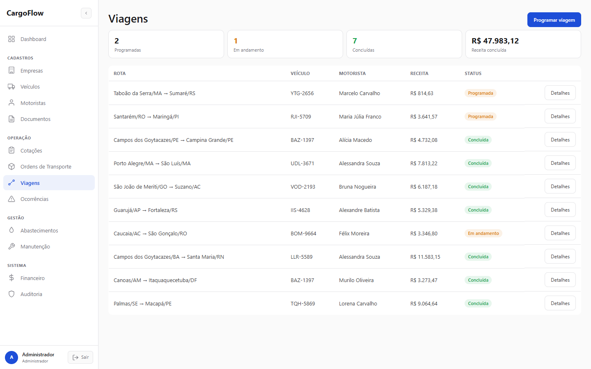
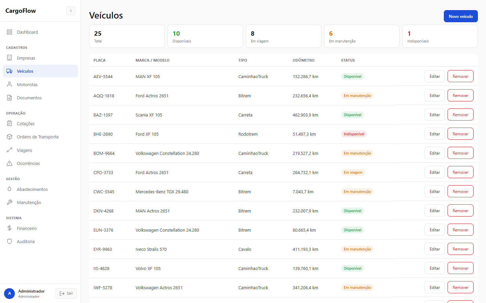
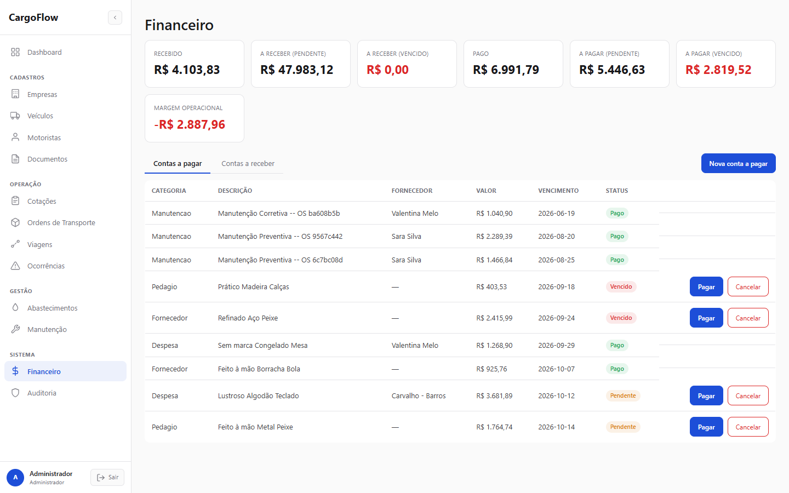

# CargoFlow

Um TMS (Transportation Management System) construído do zero como projeto de portfólio/estudo — não um "CRUD de transportadora", mas uma plataforma que cobre o ciclo real de uma operação de transporte de cargas: cotação configurável, ordem de transporte, programação, viagem (com custo/receita/margem calculados), ocorrências, abastecimento, manutenção, financeiro e auditoria, tudo orientado a regras de negócio reais e amarrado por um simulador que movimenta o sistema inteiro sozinho.

## Telas

**Dashboard com o simulador de operação rodando ao vivo** — feed de eventos transmitido por SSE, KPIs clicáveis e relógio virtual acelerado:



| Cotações de frete | Viagens |
|---|---|
|  |  |

| Veículos | Financeiro |
|---|---|
|  |  |

## Por quê

O objetivo não foi reproduzir um TMS comercial completo, e sim demonstrar engenharia de software aplicada a um domínio de negócio complexo: modelagem de domínio rica (não anêmica), regras de negócio reais (não hardcoded), arquitetura orientada a eventos em processo, API REST bem separada em camadas, frontend conectado de ponta a ponta, e testes cobrindo exatamente as regras que importam — sem inflar o projeto com infraestrutura que não agrega nada nesta escala (ver [Decisões técnicas](#decisões-técnicas) sobre o que foi deliberadamente deixado de fora).

## Stack

- **Backend**: C# / .NET 10, ASP.NET Core Web API, Entity Framework Core
- **Banco**: SQLite (arquivo local, sem servidor nem Docker)
- **Frontend**: React + TypeScript (Vite), sem biblioteca de componentes — CSS próprio
- **Autenticação**: JWT, RBAC com 5 perfis
- **Eventos em processo**: MediatR (domain events, sem message broker externo)
- **Gráficos**: Recharts
- **Testes**: xUnit

## Como executar

**Um clique** (Windows): clique duas vezes em `start-cargoflow.bat` na raiz do repo. Ele sobe a Api e o frontend, espera tudo ficar pronto e abre o navegador sozinho em `http://localhost:5180`. Sem Docker, sem instalar banco — funciona em qualquer máquina com só o .NET SDK e o Node instalados.

**Manual**:

```bash
dotnet run --project CargoFlow.Api --urls https://localhost:7099;http://localhost:5099
cd frontend && npm install && npm run dev                # http://localhost:5180
```

O banco é um arquivo SQLite local (`CargoFlow.Api/cargoflow.db`), migrado e populado automaticamente no primeiro `dotnet run` (migrations + seed de dados de demonstração via [Bogus](https://github.com/bchavez/Bogus), locale `pt_BR` — nomes, CPFs, placas e endereços são todos fictícios). `.env` já vem com credenciais de desenvolvimento reais commitadas (repositório privado pessoal, decisão deliberada para "clonar e já funcionar" — nunca faça isso num repo público ou com dado real).

### Login

5 usuários seedados automaticamente, senha `CargoFlow@123` para todos:

| Usuário | Perfil |
|---|---|
| `admin` | Administrador |
| `operacional` | Operacional |
| `financeiro` | Financeiro |
| `manutencao` | Manutenção |
| `motorista` | Motorista |

## Funcionalidades

**Cadastros**: Empresas (multi-papel: cliente/embarcador/destinatário/fornecedor/parceiro, com endereços e contatos), Veículos, Motoristas, Documentos (polimórfico — vincula a veículo/motorista/empresa, com status válido/próximo do vencimento/vencido calculado automaticamente).

**Operação**: Tabela de preços configurável por tipo de veículo/carga (nada hardcoded) → Cotação de frete com cálculo ao vivo enquanto o formulário é preenchido → Ordem de Transporte (gerada direto de uma cotação aprovada) → Programação/Viagem (com as 3 regras de elegibilidade abaixo) → linha do tempo da viagem, despesas, conclusão de entrega → **faturamento automático** ao concluir a entrega.

**Gestão**: Ocorrências (com workflow automático — uma "Quebra" torna o veículo indisponível), Abastecimento (com validação de coerência de odômetro e cálculo de consumo km/l), Manutenção (preventiva/corretiva), Financeiro (contas a pagar/receber), Auditoria (log automático de criação/edição/exclusão em toda entidade sensível).

**Dashboard**: KPIs operacionais e financeiros, todos clicáveis (levam direto pro registro de origem), gráfico de receita/entregas dos últimos 14 dias, listas de documentos vencendo e ocorrências abertas.

**Simulador de operação** — ver seção dedicada abaixo.

## Regras de negócio

| Regra | Onde vive |
|---|---|
| Motorista com CNH vencida não pode ser escalado | `TripSchedulingRules.ValidateDriverEligibility` |
| Veículo indisponível não pode ser usado | `TripSchedulingRules.ValidateVehicleEligibility` |
| Veículo incompatível (capacidade) não pode ser programado | `TripSchedulingRules.ValidateVehicleCompatibility` |
| Documento crítico vencido bloqueia a operação | `DocumentComplianceService.HasBlockingExpiredDocumentsAsync` |
| Viagem concluída/cancelada não recebe novas despesas | Guard no próprio `Trip` (rich domain model) |
| Entrega concluída gera faturamento automaticamente | `DeliveryCompletedEvent` → `BillingGenerationHandler` |
| Custos da viagem compõem sua rentabilidade | `TripFinancialService.CalculateProfitability` |
| Abastecimento respeita coerência de quilometragem | `FuelingOdometerValidator` |
| Evento duplicado não duplica efeito (idempotência) | `BillingGenerationHandler` checa recebível existente antes de criar |
| Operação financeira crítica é auditável | Interceptor de `SaveChanges` no `CargoFlowDbContext` |

## O simulador de operação

O diferencial do projeto. Um botão "Iniciar simulação" no Dashboard que:

1. Pega Ordens de Transporte em estado "Criada", programa em viagens reais escolhendo veículo/motorista elegíveis (mesmas regras acima).
2. Toca o roteiro de cada viagem em um **relógio virtual acelerado** (30x a 300x configurável): saída → abastecimento → às vezes uma ocorrência (furo de pneu, atraso...) que se resolve sozinha → chegada → **faturamento automático**.
3. Cada passo chama exatamente o mesmo Application Service que a tela usa — não existe um caminho de dado falso paralelo. Uma viagem simulada é indistinguível de uma operada manualmente, exceto pelo campo `Source` no seu log de eventos.
4. O progresso é transmitido ao vivo para o navegador via **Server-Sent Events** (consumido com `fetch`/`ReadableStream`, não o `EventSource` nativo, porque este último não permite mandar o header `Authorization`).

Termina sozinho quando todas as viagens escaladas chegam ao destino — sem loop infinito, sem intervenção manual.

## Arquitetura

Modular monolith (sem microserviços — desnecessário nesta escala), camadas clássicas:

```
CargoFlow.Api             -- Controllers, autenticação JWT, SSE, hosted services
CargoFlow.Application      -- Casos de uso, DTOs, regras de negócio, MediatR handlers
CargoFlow.Domain            -- Entidades ricas, enums, domain events (zero dependências)
CargoFlow.Infrastructure    -- EF Core, repositórios, seed de dados, integração de storage
CargoFlow.Application.Tests -- xUnit
frontend/                    -- React + TypeScript (Vite), consumindo a Api via fetch + JWT
```

Organização por módulo dentro de cada camada (`Domain/Entities/Trips/`, `Application/Trips/`, etc.) — mesmo módulo, mesma pasta, em todas as camadas.

## Decisões técnicas

- **Sem RabbitMQ/Redis/OpenTelemetry.** O domínio pede "processamento assíncrono orientado a eventos" — entregue via **MediatR em processo** (domain events publicados após `SaveChanges`, handlers reagindo a eles). Um broker de mensagens real, cache distribuído e observabilidade completa agregariam complexidade de infraestrutura sem agregar nada ao que o projeto quer demonstrar nesta escala. A arquitetura de eventos (vocabulário, handlers, idempotência) é a mesma que seria usada com um broker real — só a transportadora muda.
- **Domain events vivem no Domain, não na Application.** `AggregateRoot` referencia só `MediatR.Contracts` (as interfaces, não a implementação) para levantar eventos como `TripStartedEvent`/`DeliveryCompletedEvent` — mantém o Domain com zero dependência de infraestrutura, e os handlers (que sim ficam na Application) continuam podendo reagir a eles.
- **`Trip` é o único agregado com modelo realmente rico** (guards + domain events) — é o objeto central do domínio e o que o simulador movimenta; os demais cadastros são intencionalmente mais simples (CRUD com validação de serviço), sem impor complexidade onde ela não compra nada.
- **JWT com 5 perfis fixos**, não ASP.NET Identity completo — RBAC simples e funcional sem o peso de um framework de autenticação inteiro para 5 papéis conhecidos de antemão.
- **Sem geocodificação real.** Distância entre origem/destino é uma estimativa plausível informada manualmente na cotação (e gerada pelo simulador) — nenhuma integração de mapas está no escopo desta entrega.
- **SSE via `fetch`, não `EventSource`.** O navegador não permite mandar headers customizados (como `Authorization`) numa conexão `EventSource` nativa — o stream do simulador é consumido lendo `response.body` manualmente, mantendo o endpoint protegido pelo mesmo JWT que todo o resto da Api.

## Testes

```bash
dotnet test CargoFlow.Application.Tests
```

37 testes unitários cobrindo exatamente as regras de negócio da tabela acima: cálculo de cotação (componentes somam o total, valor mínimo aplicado), elegibilidade de motorista/veículo (CNH vencida, indisponível, incompatível), margem/custo-por-km, idempotência de faturamento duplicado, coerência de odômetro, transições de status de documento. Sem suíte de integração/e2e nem CI/CD — decisão deliberada de escopo para um projeto de estudo pessoal (ver contexto original em `docs/` se existir, ou histórico do projeto).

## Dados de demonstração

Banco populado automaticamente no primeiro start: ~15 empresas, ~25 veículos, ~30 motoristas, ~40 documentos (com uma mistura proposital de vencidos/próximos do vencimento), regras de preço para os 6 tipos de veículo, cotações em vários status, ordens de transporte (incluindo algumas em "Criada", prontas pro simulador), viagens concluídas com histórico de custo/receita, abastecimentos, manutenções e ocorrências. Tudo gerado via Bogus (`pt_BR`) — nenhum dado real.

## O que ficou de fora (por decisão de escopo, não por esquecimento)

- Rastreamento GPS em tempo real (geolocalização de veículo)
- Camada de analytics/IA sobre os dados
- RabbitMQ, Redis, OpenTelemetry/Grafana
- Testes de integração/e2e, CI/CD
- Autoatendimento do cliente (portal externo) — o sistema é 100% interno/operacional

## Sobre a escolha do SQLite

O projeto rodou com PostgreSQL (via Docker) até 2026-09-09, mas passou a usar **SQLite** para eliminar qualquer dependência de infraestrutura na hora de rodar numa máquina nova (ex: apresentar o projeto num computador sem Docker instalado) — o banco vira um único arquivo local, sem processo de servidor, sem instalação. O domínio não usa nenhum recurso específico do Postgres (sem `jsonb`, arrays, `ILIKE`), então a troca de provider do EF Core não exigiu nenhuma mudança de modelo — só a camada de configuração/migrations.
